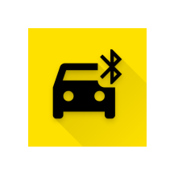
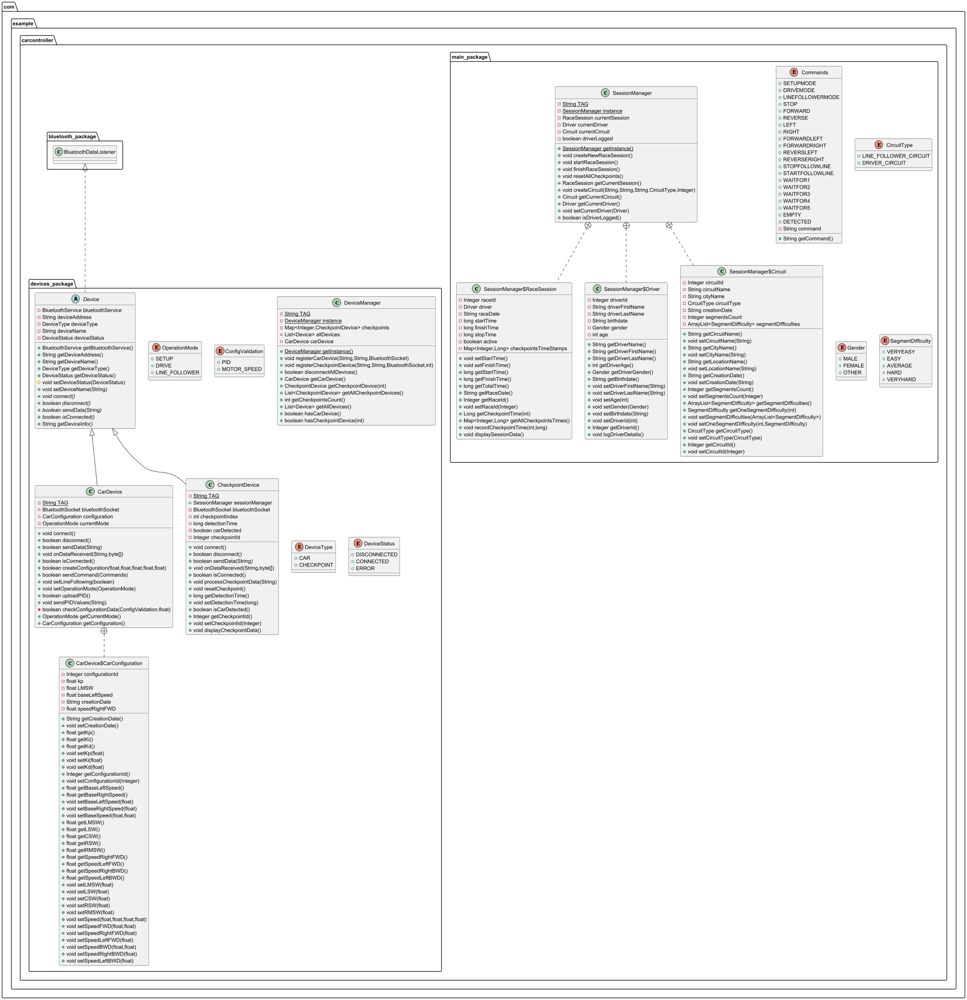
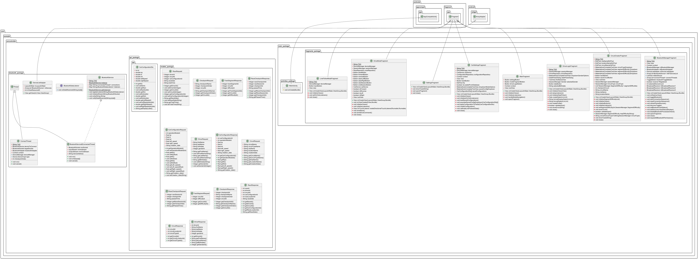

# APEX Car Controller

<p align="center">
  
</p>

## Contents

1. [Introduction](#introduction)
2. [Installation and Setup](#installation-and-setup)
   - [Project Setup](#project-setup)
   - [Database Configuration](#database-configuration)
   - [Local Database Connection](#local-database-connection)
   - [Car and Checkpoint Devices](#car-and-checkpoints-devices)
3. [Main Structure](#main-structure)
   - [Device (Abstract Class)](#device-abstract-class)
   - [CheckpointDevice](#checkpointdevice)
   - [CarDevice](#cardevice)
   - [DeviceManager](#devicemanager)
   - [SessionManager](#sessionmanager)
4. [Supporting Application Structure](#supporting-application-structure)
   - [Bluetooth Operations](#bluetooth-operations)
     - [Bluetooth Manager Fragment](#bluetooth-manager-fragment)
     - [Bluetooth Connection Thread](#bluetooth-connection-thread)
     - [Bluetooth Service](#bluetooth-service)
     - [Bluetooth Data Listener](#bluetooth-data-listener)
   - [Database API Communication](#database-api-communication)
     - [ApiClient](#apiclient)
     - [ApiService](#apiservice)
     - [Request and Response Models](#request-and-response-models)
     - [Repositories](#repositories)
5. [Languages Used](#languages-used)


## Introduction

**APEX Car Controller** is an application developed as a submission for the **Object-Oriented Programming Laboratory** project.

The application is designed as a controller that supports Bluetooth communication with a car device. It allows the configuration of the car’s **PID parameters**, where the car functions as a **line follower**, and supports multiple operation modes:
- **Driver Mode** – the user manually controls the car through the application  
- **Line Follower Mode** – the car follows a predefined path autonomously  
- **Setup Mode** – the car is ready to receive configuration instructions  

The project is built in accordance with **Object-Oriented Programming principles**.

The application supports driver authentication, allowing a registered driver to log in and operate the car. Circuits can be created by selecting the **location**, **city**, **circuit name**, **circuit type**, **segment difficulty**, etc.

Via a **Python API**, application data is further processed and stored in a **PostgreSQL database**, including driver data, car configuration data, race session data, circuit data, and related information.

The project will be further improved and refined in future iterations. This documentation provides a thorough overview and tutorial for using the application.
## Installation and Setup

This application targets **Android 16.0 (Baklava)** with **API level 36**.

### Project Setup

Clone the repository and open it in **Android Studio**:

```bash
git clone https://github.com/Claudiu0707/apex-car-controller
```
### **Database Configuration**

A PostgreSQL database is required for data persistence. The database schema must match the one described later in this documentation. The Python API must be configured according to the instructions in the repository below:
```bash
git clone https://github.com/Claudiu0707/android-postgres-api
```

### **Local Database Connection**

The default localhost address must be replaced with the IP address of the device hosting the Python API. Android applications cannot directly access the host machine’s localhost. The following configuration files must be updated with your hosting device ip

<td>https://github.com/Claudiu0707/apex-car-controller/blob/fb129fea5a48b653427130c876deee98f86afb97/app/src/main/java/com/example/carcontroller/api_package/ApiClient.java#L16-L17</td>
<td>https://github.com/Claudiu0707/apex-car-controller/blob/fb129fea5a48b653427130c876deee98f86afb97/app/src/main/java/com/example/carcontroller/api_package/CarConfigurationClient.java#L11-L11</td>

> [!IMPORTANT]  
> It is very important that these lines are modified accordingly, otherwise the connection to the API will fail silently and no data will be saved. Also, the URL must provide 8000 as the port.

### **Car and Checkpoints devices**

For the car device, follow the instructions provided in the documentation available in the readme.md from the [car project](https://github.com/Claudiu0707/zamfirel-2) to construct and program it. Same thing is valid for the [checkpoint devices](https://github.com/Claudiu0707/checkpoint-example)

## Main Structure
This chapter focuses on the main **Object-Oriented Programming (OOP)** – related classes. It explains the design rationale behind them, how they are structured, and the roles they fulfill within the application.

<p align="center">
  
</p>
<p align="center"><em>Figure 1 – Device and session management architecture</em></p>

### Device (Abstract Class)

The `Device` class represents a generic Bluetooth-enabled device within the application. It serves as an abstract base class for all concrete device implementations and defines the common structure and behavior required for Bluetooth communication.

This class implements the `BluetoothDataListener` interface and is responsible for registering itself with the shared `BluetoothService` instance to receive incoming data associated with its device address.

#### Abstract Methods
The class does not implement connection logic directly. Instead, it defines a set of abstract methods (`connect`, `disconnect`, `sendData`, and `isConnected`) that must be implemented by concrete subclasses. 

- `connect()` – Initializes the device connection and data stream
- `disconnect()` – Closes the connection and updates the device status
- `sendData(String data)` – Sends data to the device
- `isConnected()` – Checks the current connection state

Overall, this class centralizes common device-related behavior and enforces a clear structure.

### CheckpointDevice

The `CheckpointDevice` class represents a physical checkpoint that communicates with the application over Bluetooth. It extends the abstract `Device` class and implements the specific logic required to detect when a car passes a checkpoint during a race session.

Each checkpoint maintains its own Bluetooth socket, an index that identifies its position within a circuit, and internal state used to track whether a car has already been detected. This prevents multiple detections of the same car during a single race session.

Incoming Bluetooth data is handled through the `onDataReceived` callback. When a detection command is received, the checkpoint records the detection timestamp and forwards this information to the current race session managed by the `SessionManager`. This allows checkpoint timing data to be collected in a centralized way without coupling the checkpoint directly to session logic.

The class also provides utility methods for resetting its internal state when a new race session starts, as well as basic logging methods used during debugging and development.


### CarDevice

The `CarDevice` class represents the controllable car and is responsible for handling all Bluetooth communication related to car operation, configuration, and control modes. It extends the abstract `Device` class and provides concrete implementations for connection handling and data transmission.

The car supports multiple operation modes (`SETUP`, `DRIVE`, and `LINE_FOLLOWER`), which determine how incoming commands are interpreted and which actions are allowed. Mode changes are translated into predefined commands and sent directly to the car over Bluetooth.

Configuration of the car is handled through the nested `CarConfiguration` class. This class stores PID calibration values and base motor speeds used in line-following mode. Before a configuration is created, input values are validated to ensure they fall within acceptable ranges. PID values are uploaded to the car using a structured command sequence that accounts for the length of each parameter.

The `CarDevice` class also centralizes higher-level actions such as starting or stopping line following and uploading configuration data, while keeping low-level Bluetooth operations abstracted through the shared `BluetoothService`.

### DeviceManager

The `DeviceManager` class acts as a central point for creating, storing, and managing all Bluetooth devices used by the application. Any component that needs to interact with the car or checkpoint devices accesses them through this manager.

The class is implemented as a singleton to ensure that only one device manager exists at runtime. This avoids inconsistencies that could appear if multiple parts of the application attempted to manage Bluetooth devices independently.

`DeviceManager` is responsible for registering both the car device and checkpoint devices. Each registered device is stored internally, allowing the manager to keep track of all active connections and perform collective operations, such as disconnecting all devices at once.

Checkpoint devices are indexed based on their order of connection and placement on the circuit. This index is used as a stable reference throughout a race session, making it easier to associate timing data with the correct checkpoint.

The class also provides helper methods for querying device availability, retrieving specific devices, and checking whether a car or checkpoint device is currently connected. By centralizing these responsibilities, `DeviceManager` simplifies device handling logic across the application and keeps Bluetooth-related state management consistent.


### SessionManager

The `SessionManager` class acts as the central coordinator for race-related data within the application. It is responsible for managing the current race session, the active driver, and the selected circuit, as well as handling the interaction between these elements during a race.

The class is implemented as a singleton to ensure that session-related state is consistent across the application. Since race sessions, drivers, and circuits are global concepts during runtime, having a single shared instance prevents conflicting or duplicated state.

A race session can be created and controlled through this manager. The session lifecycle is clearly defined: a session is created, started, and eventually finished. When a session starts, all checkpoint devices are reset to ensure that no stale detection data carries over from a previous run. During an active session, checkpoint detection times are recorded relative to the session start time.

Driver management is also handled here. A driver can be set as the current active user, and certain constraints are enforced depending on the car’s operation mode. For example, a driver is required when operating the car in drive mode, while line follower mode allows sessions to run without an active driver.

Circuit creation and storage are centralized in the same manager. Each circuit contains metadata such as location, type, number of segments, and per-segment difficulty, allowing race sessions to be associated with a well-defined track configuration.

To keep related data grouped together, `SessionManager` defines inner classes for `RaceSession`, `Driver`, and `Circuit`.


## Supporting Application Structure
This chapter focuses on parts of the application structure that are **not directly related to the main OOP requirements**. These components are nevertheless essential for the overall functionality of the application.
They include elements such as Bluetooth operations, user interface components that allow navigation through the application, and communication with the database API.

<p align="center">
  
</p>
<p align="center"><em>Figure 2 – Supporting architecture</em></p>

---

### Bluetooth Operations

### Bluetooth Manager Fragment

`BluetoothManagerFragment` is a class specific to Android applications and is used to manage Bluetooth-related user interactions. It incorporates layout inflaters that allow the integration of basic UI elements, which in this application are implemented as XML-defined components.

This fragment provides a centralized menu through which the user can perform all Bluetooth operations. From this interface, the user can start Bluetooth discovery, pair with new devices, or select from a list of devices that are already paired.

> [!IMPORTANT] 
> When selecting devices, the user must follow a strict order: the car device must be selected first, followed by checkpoint devices in their connection order (checkpoint 1, checkpoint 2, and so on). This order is important because devices are registered sequentially, and the first selected device is always treated as the car device.

If the user makes a mistake during the selection process or decides to change the selected devices, the selection can be reset using a dedicated reset button provided in the interface.

### Bluetooth Connection Thread

After the user selects the devices and starts the connection sequence, each selected device must open a Bluetooth communication socket. Since this operation is blocking, it must be executed on a separate thread to avoid freezing the user interface.
This responsibility is handled by the `ConnectThread` class. 

The thread creates an RFCOMM communication socket using the standard Bluetooth UUID `00001101-0000-1000-8000-00805F9B34FB` and attempts to establish a connection with the target device.

During this stage, the devices are also registered together with their newly created sockets. These sockets are later used by the application to initialize data streams and perform Bluetooth communication.

### Bluetooth Service

The `BluetoothService` class centralizes all low-level Bluetooth communication used by the application. It acts as a shared service responsible for managing active Bluetooth connections, handling data streams, and dispatching incoming data to the appropriate device logic.

The class is implemented as a singleton to ensure that all devices interact with the same Bluetooth communication layer. Each connected device is identified by its Bluetooth address, which is used as a key to manage both its active connection thread and its corresponding data listener.

When a device connection is established, the service initializes a dedicated communication thread (`ConnectedThread`). This thread is responsible for maintaining the input and output streams associated with the Bluetooth socket and continuously listening for incoming data.

Incoming data is processed at the byte level and grouped into fixed-size instructions before being forwarded to the registered listener for the corresponding device. 

Outgoing communication is handled through a simple write interface, which forwards data to the appropriate connection thread based on the device address.

### Bluetooth Data Listener

`BluetoothDataListener` is a simple interface used to notify device classes when new Bluetooth data is received. It defines a single callback method that is triggered by the Bluetooth communication layer whenever data becomes available for a specific device.
Classes such as car and checkpoint devices implement this interface in order to receive and process incoming data relevant to their own behavior.

---

### Database API communication
### ApiClient

The `ApiClient` class is responsible for configuring and providing access to the application’s backend API. It centralizes all network-related setup required for communication with the database layer exposed through the Python API. Internally, it configures an `OkHttpClient` with custom timeout values and an HTTP logging interceptor.

Network requests are handled using Retrofit, with JSON serialization managed through a Gson converter. The base URL is defined at initialization time and must be updated depending on whether the application is running on an emulator or a physical device.

### ApiService

`ApiService` defines the set of HTTP endpoints used by the application to communicate with the backend database API. It is implemented as a Retrofit interface, where each method maps directly to a specific REST endpoint.

The interface groups all API operations related to . Each method specifies the HTTP request type and the request body model required by the backend.

### Request and Response Models

For every type of data that needs to be stored persistently in the database—such as drivers, races, car configurations, circuits, checkpoints, and race-related timing information, the application defines corresponding **request** and **response** models.

These models are designed to match the structure and requirements of the endpoints exposed by the Python API. They are responsible for defining how data is serialized when sent to the backend and how responses are deserialized when data is received.

All request and response models are grouped inside the [`models_package`](https://github.com/Claudiu0707/apex-car-controller/tree/main/app/src/main/java/com/example/carcontroller/api_package/models_package).

### Repositories

API requests and responses are handled through repository classes, each implemented as a singleton. These repositories act as an abstraction layer between the application logic and the networking layer.

Each repository is responsible for:
- Calling the appropriate API endpoint via `ApiService`
- Handling asynchronous requests using Retrofit callbacks
- Processing responses and errors
- Exposing results through callback interfaces

---

## Languages Used

The main application architecture is implemented using **Java** and the **JDK**. Although newer technologies such as Kotlin and Flutter are increasingly promoted as alternatives for Android development, Java is still widely used in industry, especially in legacy and large-scale projects. For this reason, Java was chosen as the primary development language.

The user interface is built using **XML layouts**. The UI is intentionally simple and functional. While it does not aim to be visually complex or highly polished, it integrates seamlessly with Android Studio and requires no additional setup. The focus was placed on functionality rather than visual design.

Communication between the Android application and the PostgreSQL database is handled through a **Python-based API**. This API provides a straightforward way to transmit data between the application and the database. PostgreSQL is not accessed directly from the Android app, as it is not designed for local storage in the same way as SQLite. Instead, all database interactions are routed through the backend API.


